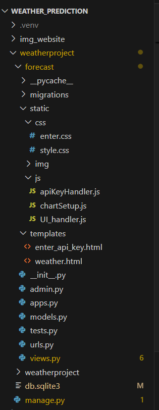
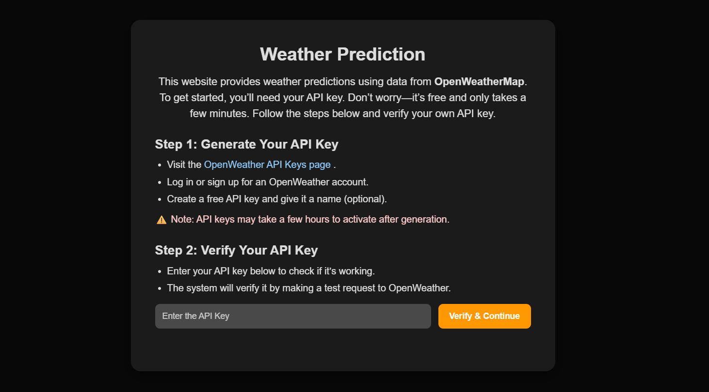
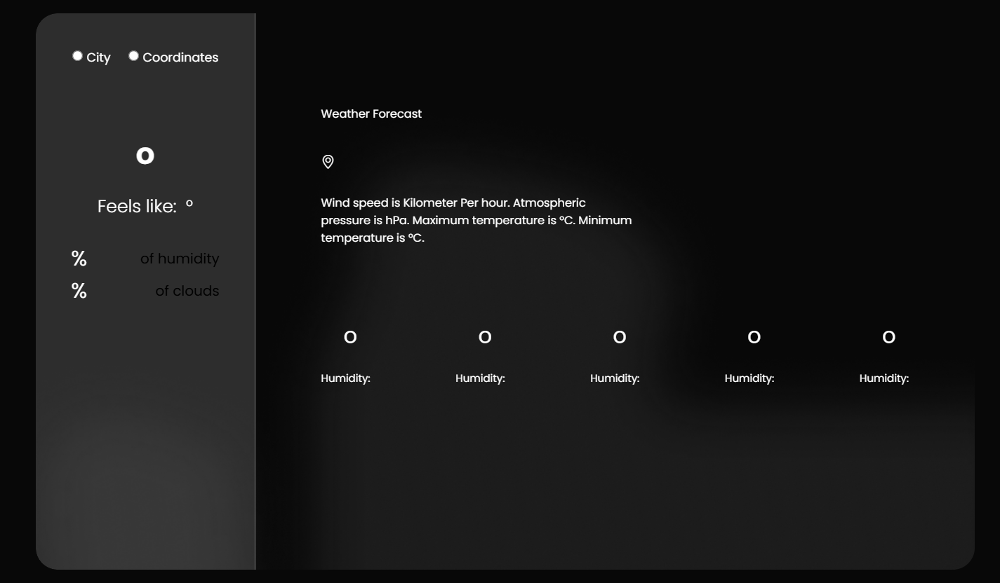
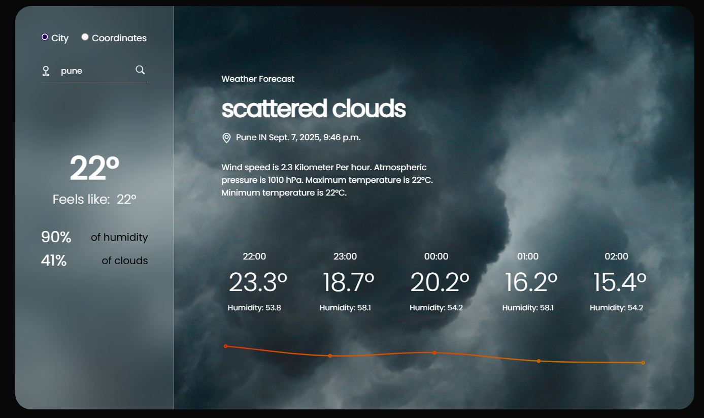

#  Weather Prediction Website

A Django-based web application that predicts weather conditions using the **OpenWeatherMap API**.  
Users can:
- Enter their own API key (stored securely in session, not saved permanently).
- Get real-time weather updates by city name or coordinates.
- View data in a clean and styled interface.

##  Features
- Secure API key entry & validation
- Current weather data (temperature, humidity, etc.)
- Easy-to-use interface
- Session-based API key handling (disappears when the tab is closed)

##  Tech Stack
- **Backend**: Django (Python)
- **Frontend**: HTML, CSS, JavaScript (with SweetAlert2 for popups)
- **API**: OpenWeatherMap

##  Python File
- There is a simple Python file named "temp_predict" which gives temp predicted values
- You can simple install the required tools and run this file 

##  Setup Instructions
1. Clone the repository  
   ```bash
   git clone https://github.com/raqibuddin/weather_prediction.git

2. Create this directories
- After cloning if any file is missed by any chance,
- Please verify them accordingly.
  
  
  
  

3. Install Requirements
- The requirements.txt has the tools and firware to be installed to run this.
   ```bash
   pip install -r requirements.txt

4. Enter into "weatherproject" directory
- Using the terminal, enter into "weatherproject" directory
   ```bash
   cd weatherproject

5. Run Migrations
   ```bash
   python manage.py migrate

6. Run Development Server
   ```bash
   python manage.py runserver

7. Visit the website
- now visit the website which is being showned in the terminal.

8. User interfaces
- Before entering into the weather view page




- After entering into the weather view page




- After entering a city name or coordinates you can get the current weather details and predicted temp and humidity values

